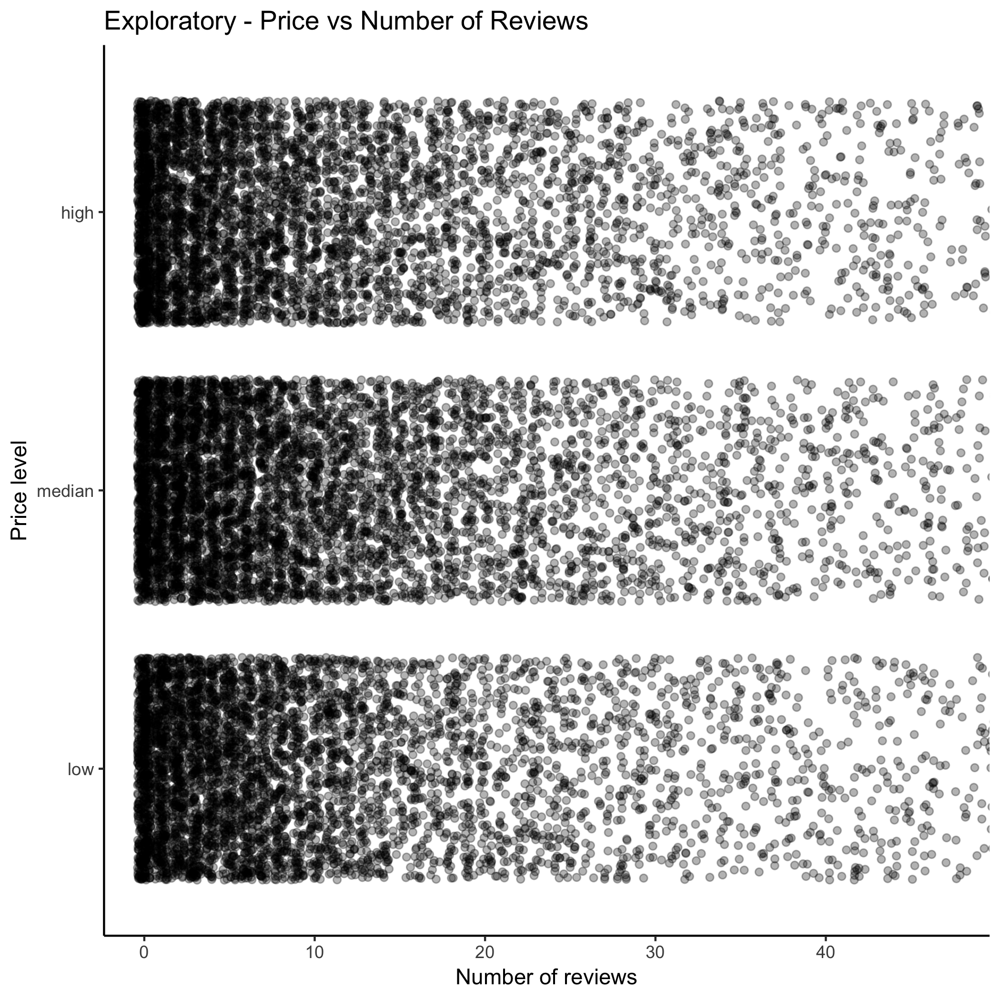
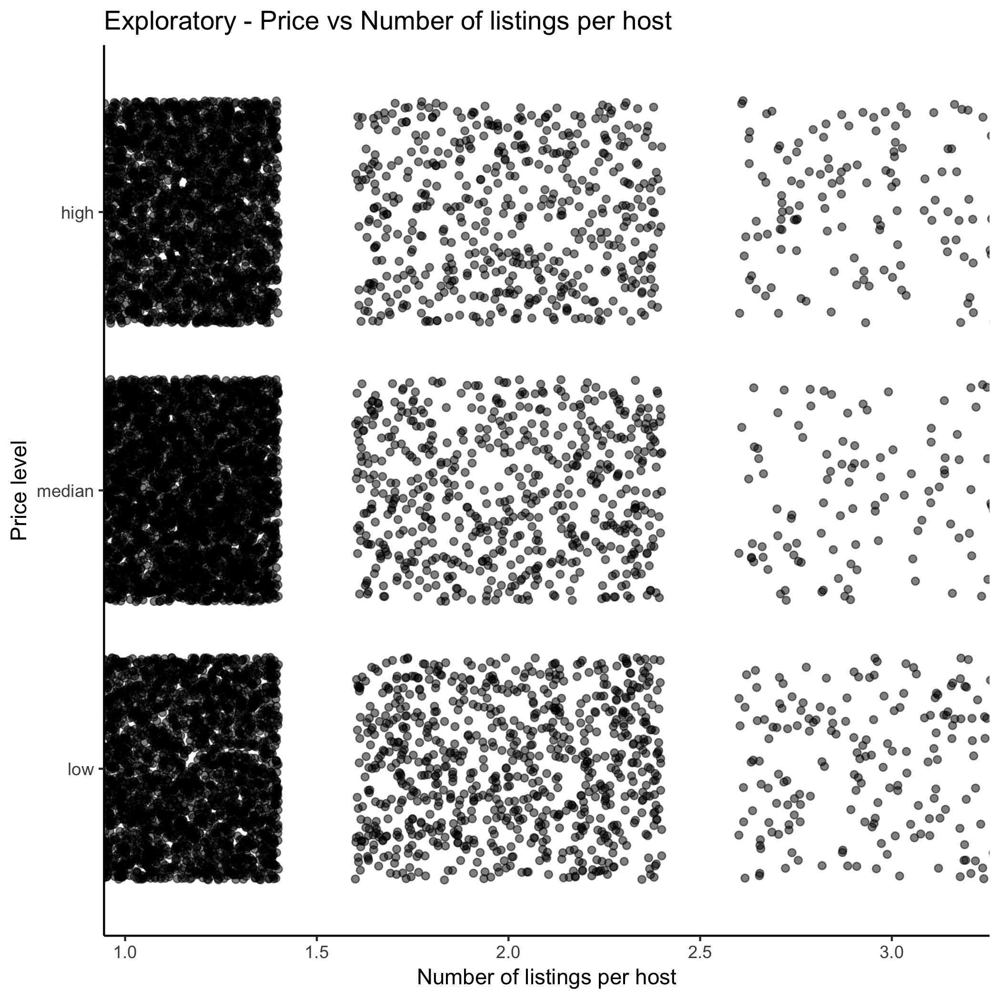
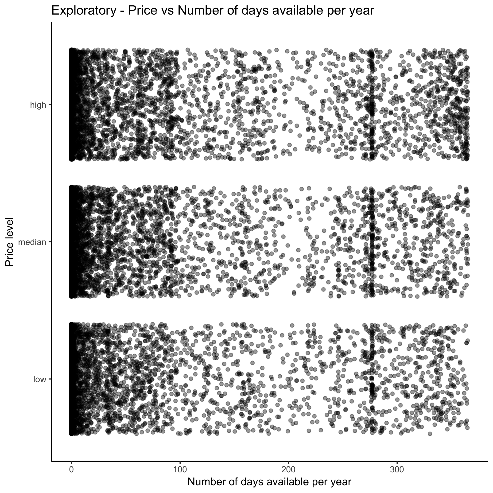

Main Report
================

Airbnb is Amsterdam!
--------------------

Airbnb renting has always been interesting. Some spots can be rented in higher prices, whereas other spots can only be rented in very low prices. Suppose you would like to be a host in Amsterdam, in order to be a successful host, it is a good idea to investgate the host listing data from airbnb and see what are the major predictors of the room prices. In this project, we are going to do this job for those who want to be a successful host! Therefore, in our project, a question that is reasonable to ask is: What are the two strongest predictors of price for airbnb listings in Amsterdam? We are going to analyse the host listing data in Amsterdam and find out the answer!

Analyzing and Prediction
------------------------

From the [Website](http://insideairbnb.com/get-the-data.html), we found the host listing data of Airbnb in Amsterdam. Before starting analyze the data, let's take a look at the data.

``` r
data=read.csv("data/amsterdam_listings.csv")
head(data)
```

    ##      id                                              name host_id
    ## 1  2818          Quiet Garden View Room & Super Fast WiFi    3159
    ## 2  3209                 Quiet apt near center, great view    3806
    ## 3 20168 100%Centre-Private Floor/Bathroom-Lockable Studio   59484
    ## 4 25428               Lovely apt in City Centre (Jordaan)   56142
    ## 5 27886 Romantic, stylish B&B houseboat in canal district   97647
    ## 6 28658               Cosy guest room near city centre -1  123414
    ##   host_name neighbourhood_group                          neighbourhood
    ## 1    Daniel                  NA Oostelijk Havengebied - Indische Buurt
    ## 2   Maartje                  NA                             Westerpark
    ## 3      Alex                  NA                           Centrum-Oost
    ## 4      Joan                  NA                           Centrum-West
    ## 5      Flip                  NA                           Centrum-West
    ## 6   Michele                  NA                          Bos en Lommer
    ##   latitude longitude       room_type price minimum_nights
    ## 1 52.36575  4.941419    Private room    69              3
    ## 2 52.39023  4.873924 Entire home/apt   160              4
    ## 3 52.36509  4.893541    Private room    80              1
    ## 4 52.37311  4.883668 Entire home/apt   125             14
    ## 5 52.38673  4.892078    Private room   150              2
    ## 6 52.37534  4.857289    Private room    65              3
    ##   number_of_reviews last_review reviews_per_month
    ## 1               243  2018-10-01              2.10
    ## 2                42  2018-08-29              1.08
    ## 3               221  2018-09-20              2.11
    ## 4                 1  2018-01-21              0.12
    ## 5               164  2018-10-04              2.00
    ## 6               426  2018-10-02              4.17
    ##   calculated_host_listings_count availability_365
    ## 1                              1               90
    ## 2                              1               96
    ## 3                              2              132
    ## 4                              2               65
    ## 5                              1              209
    ## 6                              2              297

From the data, we can see that there are several features inside:

-   **id**: Unique identification code for the listing
-   **name**: Descriptive name of the listing
-   **host\_id**: Unique identification code for the host
-   **host\_name**: First name of the host (privacy is respected. The data is open.)
-   **neighbourhood**: A categorical character variable that specifies the name of neighbourhood of the listing
-   **latitude**: A numeric variable that combining the **longitude** to represent the location of the listing
-   **longtitude**A numeric variable that combining the **latitude** to represent the location of the listing
-   **room\_type**: A categorical variable including **Shared Room**, **Private Room** or **Entire Room/Apt**.
-   **price**: The price of the listing.
-   **minimum\_nights**: The minimum number of nights the host requires to book their property.
-   **number\_of\_reviews**: Number of customer reviews regarding the listing.
-   **last\_review**: Date of the last review.
-   **reviews\_per\_month**: Number of customer reviews per month.
-   **calculated\_host\_listings\_count**: Number of listings each host has simultaneously.
-   **availability\_365**: The number of days that the listing is available in a 365 days, which is pre-defined by the host.

After looking at the data, we predict that `neighbourhood`, `location(latitude and longtitude)`, `room_type`, `minimum_nights`, `number_of_reviews`, `reviews_per_month`, `calculated_host_listings_count`, and `availability_365` can possibly be the factors affecting the price. In order to find out the two strongest predictors, after cleaning the data, we are going to first do data visualzation and have a grasp of these factors visually, then use the decision tree to find out the two strongest predictors.

Data smelling and Data cleaning
-------------------------------

After taking a look of these features, we realized that `neighbourhood` and `location(latitude and longtitude)` could act similarly in affecting the room price, and `reviews_per_month` and `number_of_reviews` could act similarly in affecting the room price also. `Latitude and longtitude` is a more complicated feature than `Neighbourhood`, since it contains two features and we must combine these two features together when analyzing(otherwise it won't make sense to use them individually). At the moment, we haven't learned how to combine two features into one and implement it in the decision tree. Therefore, at this time, we decide not to use these two features. For `reviews_per_month` and `number_of_reviews`, when we first looked at the data, we believed that `reviews_per_month` is a better feature to use than `number_of_reviews` because it is possible that some listing has more reviews because it is on airbnb longer than others. However, when we took a deep look, we found out that there are more than 2000 missing values in the `reviews_per_month`, therefore, we decided to use `number_of_reviews` instead. We also cleared out some outliers in `minimum_nights`.

Data Visulazation
-----------------

In this section, we are going to explore if each feature affects the price by visulazing it.

The first one we are going to look at is the relationship between number of reviews of a listing and its price.

 Figure 1: Relationship between the Number of Reviews per Listing and Price

From the graph, we can see that after the number of reviews greater than 10, there are many points concentrating on the lower end, whereas the upper part doesn't have that many points. As the number of reviews increases, the points at the lower part are getting fewer and fewer. This means that after the number of reviews greater than 10, as number of reviews increases, there are fewer listings that have high price. From this graph, we believe that number of reviews could be a predictor of the price, however, we are not sure if it is a strong predictor yet.

The second one we are going to look at is the relationship between minimum nights the host requires of a listing and its price.

 Figure 2: Relationship between Minimum number of nights host requires and price

From this graph, we can see that after the Minimum number of nights is greater that 8, there are more dots in lower price range, and fewer dots in higher price range. However, when the Minimum number of nights is fewer that 8, we are not sure how many dots there are at the left corner. It is possible the if the number of dots are fewer when the Minimum number of nights is fewer that 8, it will look similar to its right. Therefore, from this graph, we cannot be sure that minimum number of nights is a predictor of the price.

The third one we are going to look at is the relationship between the room type of a listing and its price.

 Figure 3: Comparision of the maximum, minimun, 25% percetile, median, and 75% percetile of prices for different room types

From this graph, we can see that the median of `Entire home/apt` is much higher than the other two, and the median of `Private Room` is higher than `Shared Room`, which makes sense since usually an `Entire home/apt` has larger area than a `Private room` and a `Shared room`, and a `Private room` has better privacy than a `Shared room`. However, if we take a look at the minimum prices, the difference isn't that big, and the minimum of a `Shared room` is even bigger than the other two. For the maximum price, `Entire home/apt` has similar value with the `Private room`, but there are more `Entire home/apt` priced over 300. Also, the 75% precentile of `Shared room` is higher than `Private room`. All in all, if we only look at the median, we can see that price is influenced by the `room_type` and `room_type` can be a predictor of the price. However, maximum, minimum, and 75% precentile of the prices are not that consistent with our found relationship with the median price, so we are not sure if `room_type` will be a strong predictor.

The fourth one we are going to look at is the relationship between the neighbourhood of a listing and its price

 Figure 4: Comparision among different neighbourhood on the maximum, minimun, 25% percetile, median, and 75% percetile of prices

In this graph, we can see there is a tendency that as neighbourhood changes from left to right, the median of the prices goes down. However, the maximum and minimum prices doesn't change that much as eighbourhood changes. Also, although 25% percentile and 75% percentile of prices decrease in general form left to right, there are some exceptions. For example, the 75% percentile of prices in `Buitenbeldent-Zuidas` is higher than some of its left conterparts. However, if we only consider the median of the prices, we can say that neighbourhood can be a predictor of the price. However, again we don't know if it will be a strong predictor.

The fifth one we are going to look at is the relationship between the number of listings that listing host has and the price of that listing.

 Figure 5: Relationship between the number of listings the host has and the price From the graph, we can see there is no correlation between the number of listings a host has and the price. Although there are more highly priced listings when the number of listings a host has is small, that is probably because there are more listings that have the host having low number of listings.

The last one we are going to look at is the relationship between the number of availability per 365 days of a listing and the its price.

 Figure 6: Relationship between the number of availability per 365 days and the price

From the graph, we can see that there is no correlation between the availability per 365 days and the price, which makes sense because usually number of availability is not related to price in real life.

After the exploration, as a result, we found that `Neighborhood`, `Number of reviews`, and `room type` could be the strong predictors of the price. We are not sure about the `minimum nights`; `Avilability_365` and `calculated_host_listings_count` are probable not the strong predictors.

Decision Tree
-------------

In order to find out the two strongest predictors of price, we are going to make a decision tree and test it out. Thes features we worthy to test out are: `neighborhood`, `room_type`, `minimum_nights`, `number of reviews`, `availability_365`, and `calculated_host_listings_count`. However, we found out neighbouhood and room\_type are categorical, which can be hard to analyze together with numeric data, especially for the `neighborhood`, its categorical values are too many, so it is hard to test. Therefore, we decide to put `meighborhood` on the shelf this time. `room_type` is also categorical, but it has fewer categorical values, so we are going to convert them into numeric for modeling.

We are going to label the price as three levels: `low`,`median`, and `high`, and set it as the output of our model. If the model can predict the output same as the expected level, we are going to say the output is accurate. For fitting the model, we are going to use 80% of the data as training data, and 20% of the data as testing data.

First, in order to get the higher accuracy, we decide to test the accuracy on the hyperparameter `max_depth`. We chosse to expriment the value of `max_depth` between 2 and 13 with our training data. After the expriment, we found out that when `max_depth` is 4, the accuracy is the highest. Therefore, we decide to use `max_depth=4` in this model.

Next, we use the training data again for fitting the model that has the hyperparameter of `max_depth=4`. After fitting the model, we are going to use this model and our testing data to predict the outputs. This is the decision tree we get:

[Figure 7: Decision Tree](../results/Tree_graph.pdf) Figure 7: The decision tree we made for analyzing the strong predictors of the price

After getting the decision tree and outputs from the model, we are going to alculate the accuracy of the outputs by comparing the outputs with the actual outputs we already had in the testing data. The accuracy we came out is *0.48239343394228223*, which is not high. This could be because all features we analyzed are not really a super strong predictor for pricing, which is actully in acordance with the findings in our data visualization.

After knowing the accuracy of the outputs, we have an idea about how accurate this model is. Next step, we are going to use this model to find out the most important factors affecting the price. After testing, we found out that `room_type` and `availability_365` are the two strongest predictors of the price. However, due to the low accuracy of this model, we are not very confident about the results. From the results of our decision tree, we are suprised that `availability_365` is actually an important predictor for pricing, whereas `number of reviews` is not. This is different from the results we explored in data visualization. Since the accuracy of the model is low, it is possible that the results from the decision trees are less trustworthy than the data visualzation, but it also could be the case that visualzation isn't accurate, since there are so many dots in a graph.

Conclusion and Limitation
-------------------------

Overall, from the data visualzation, apart from `neighborhood`, we expected `Number of reviews`, and `room type` to be the two strongest predictors. However, from the decision tree, we got `room_type` and `availability_365` as the two strongest predictors. Regardlessly, we are confident that `room_type` is a strong predictor of the price, but we are less sure about the other two.

We do know that our analysis has limitation. For example, we found out that `neighborhood` could be a strong predictor on pricing, however, due to the complexity of this categorical feature, we decided not to put it in the tree. Also, as mentioned before, we used `number of reviews` instead or `reviews per month`, which means some listings could simply can more reviews because it is on Airbnb for a long time, not because of the pricing. We also didn't analyze the `longtitude` and `latitude`, because they are a complicated feature combining together. In the future, our next approach could be to analyze if `longtitude` and `latitude` affect the price.

References
----------

Scikit-learn.org. (2018). sklearn.tree.DecisionTreeClassifier — scikit-learn 0.20.1 documentation. \[online\] Available at: <https://scikit-learn.org/stable/modules/generated/sklearn.tree.DecisionTreeClassifier.html> \[Accessed 24 Nov. 2018\]. Brownlee, J. (2018). Save and Load Machine Learning Models in Python with scikit-learn. \[online\] Machine Learning Mastery. Available at: <https://machinelearningmastery.com/save-load-machine-learning-models-python-scikit-learn/> \[Accessed 24 Nov. 2018\]. Inside Airbnb. (2018). Inside Airbnb. Adding data to the debate.. \[online\] Available at: <http://insideairbnb.com/get-the-data.html> \[Accessed 24 Nov. 2018\].
